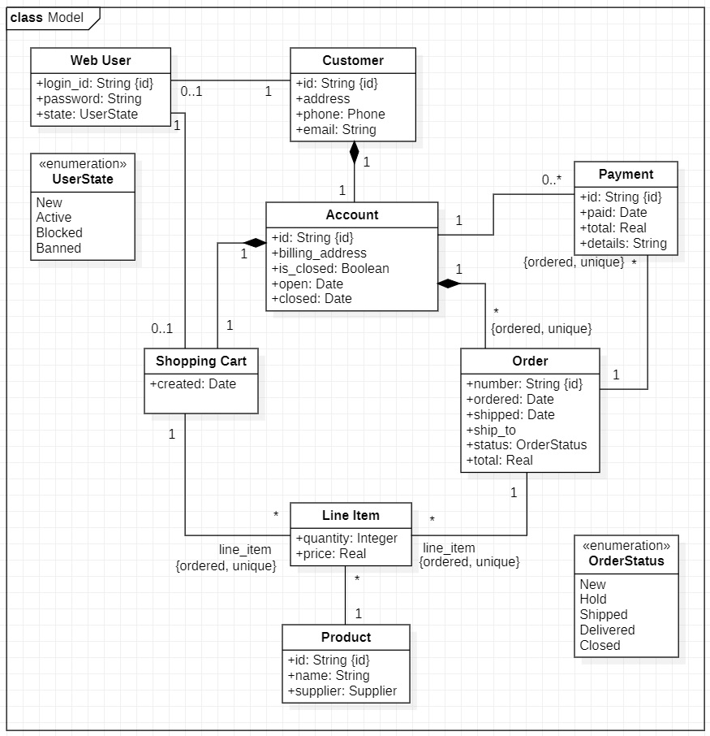
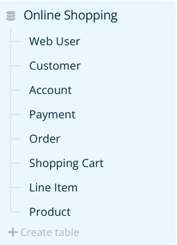
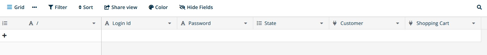

# Database initialization from UML Class Diagram to Baserow

UML Class Diagram as an XMI file is parsed in Python and then a database is created with all tables as classes and fields as attributes, enumerators and associations from a model.

Supported XMI version: 2.1
Supported UML version: 2.0

## Steps

- Copy your XMI file to `/models` folder
- Setup `env.py` with credentials
- Run `baserow_init.py`

Before integrating a model in your database, copy a prepared XMI file to `/models` folder and create your `env.py` file in a main directory.

    URL = YOUR_URL # Put https://baserow.io if you have a database on their server
    EMAIL = YOUR_EMAIL_BASEROW_ACCOUNT
    PASSWORD = YOUR_PASSWORD_BASEROW_ACCOUNT
    GROUP_NAME = YOUR_GROUP_NAME
    DATABASE_NAME = YOUR_DATABASE_NAME
    XMI_FILE = YOUR_XMI_FILE_NAME.xmi

Create a virtual environment and run `baserow_init.py`

    py -m venv ./env
    env\Scripts\activate
    python baserow_init.py

## Example

To test the example, in `env.py` file, change `XMI_FILE = "/models/online_shopping_model.xmi"`

